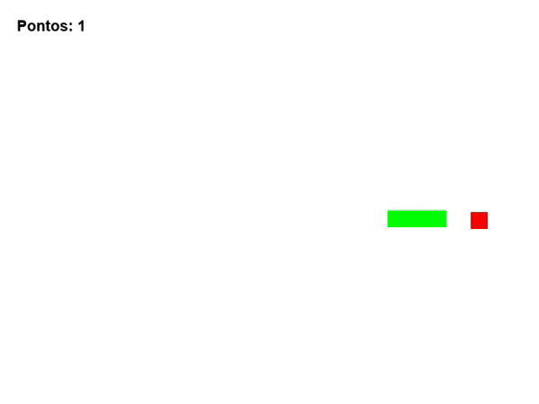

# SnakeGame

  

  

Esse projeto foi desenvolvido para fins de estudos com pygame.

## 🛠 Tecnologias
As seguintes ferramentas foram usadas na construção do projeto:
- [Python](https://www.python.org/)
- [Pygame](https://www.pygame.org/docs/)

